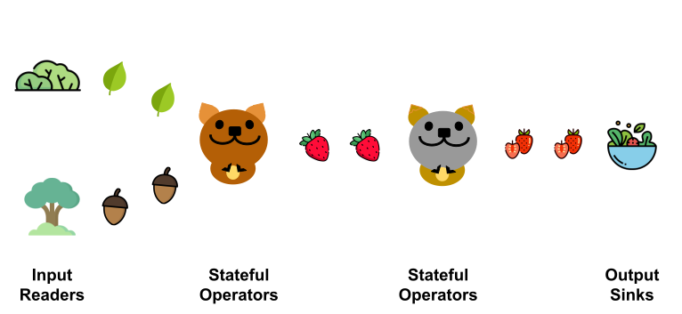

# Getting Started

## Quokka in Three Cartoons

The fundamental concept in Quokka is a **stream of Python objects**, which we call a **QStream** (Quokka Stream). Quokka doesn't quite care about the object's type -- integers, Python lists, dictionaries, Numpy arrays, Pandas tables, Torch arrays, they all work, as long as the object can be pickled. The user defines **input readers** that generate a QStream from a dataset. For example, Quokka's cloud CSV reader generates a QStream of Pyarrow Tables from an S3 bucket of CSV files. The user can also define **stateful operators** that operate on one or more QStreams to produce one more QStream. Finally a QStream could be written to an **output sink**, which could be a distributed in-memory dataset that can be converted to Pandas or stable storage on disk or S3. 

In this illustration, the bush produces a QStream of leaves and the forest produces a QStream of acorns. The brown quokka consumes those two streams and magically turn it into a stream of strawberries. The grey quokka takes in this stream of strawberries, slices them up and puts them in a salad bowl.

It would be a dismal world if there is only one quokka of each kind. Quokka supports parallelism for stateful operators with **channels**, which are parallel instantiations of a stateful operator to achieve data parallelism. Input sources can also have channels to parallelize the reading of a data source. For example, we can have two bushes and two forests, and four brown quokkas.

The single QStream of leaves from the bush to the brown Quokka actually consists of eight links of data, one from each channel in the input readers to each channel in the stateful operator! Quokka allows you to specify a **partition function**, which specifies for each object you produce in a channel in the source, how it gets sent to downstream channels. You can send the object to only one of the downstream channels, slice it up and send different slices to different channels, or send the same object to all the downstream channels! 

At its core, Quokka is an actor framework. Each channel in an input source or stateful operator constitutes an actor that can be scheduled independently to a machine in a cluster. Actors on the same machine talk to each other through memory while actors on different machines communicate through the network. Typically we want to minimize network communications. Note that different channels of a stateful operator can be scheduled on different machines. An example scheduling of our quokkas is shown below.

Quokka has default strategies to choose the number of channels for input readers and stateful oeprators based on the number of machines in the cluster, as well as the partition functions and the actor scheduling. However, the user can easily override these defaults to get better performance.

## Installation

If you plan on trying out Quokka for whatever reason, I'd love to hear from you. Please send an email to zihengw@stanford.edu.

Quokka can be installed as a pip package: 
~~~bash
pip3 install pyquokka
~~~
However it needs the latest version of Redis (at least 6.0), which you can get by running the following in sudo:
~~~bash
curl https://packages.redis.io/gpg | apt-key add -
echo "deb https://packages.redis.io/deb $(lsb_release -cs) main" | tee /etc/apt/sources.list.d/redis.list
apt-get update
apt-get install redis
~~~

If you only plan on running Quokka locally, you are done. Try to run the lessons in the apps/tutorial folder and see if they work. If they don't work, please raise an issue! 

If you plan on using Quokka for cloud, there's a bit more setup that needs to be done. Currently Quokka only provides support for AWS. Quokka provides a utility library under `pyquokka.utils` which allows you to manager clusters and connect to them. It assumes that awscli is configured locally and you have a keypair and a security group with the proper configurations. To set these things up, you can follow the [AWS guide](https://docs.aws.amazon.com/cli/latest/userguide/cli-configure-quickstart.html). 

Quokka requires a security group that allows inbound and outbound connections to ports 5005 (Flight), 6379 (Ray) and 6800 (Redis) from IP addresses within the cluster. For testing, you can just enable all inbound and outbound connections from all IP addresses. Then you can use the `QuokkaClusterManager` in `pyquokka.utils` to spin up a cluster. The code to do this:

~~~python
from pyquokka.utils import QuokkaClusterManager
manager = QuokkaClusterManager(key_name = YOUR_KEY, key_location = LOCATION_OF_KEY, security_group= SECURITY_GROUP_ID)
cluster = manager.create_cluster(aws_access_key, aws_access_id, num_instances = 4, instance_type = "i3.2xlarge", requirements = ["pandas"])
~~~

This would spin up four `i3.2xlarge` instances and install pandas on each of them. The `QuokkaClusterManager` also has other utilities such as `terminate_cluster` and `get_cluster_from_json`. Importantly, currently only on-demand instances are supported. This will change in the near future.

Quokka also plans to extend support to Docker/Kubernetes based deployments based on KubeRay. (Contributions welcome!)

Image credits: some icons taken from flaticon.com.

